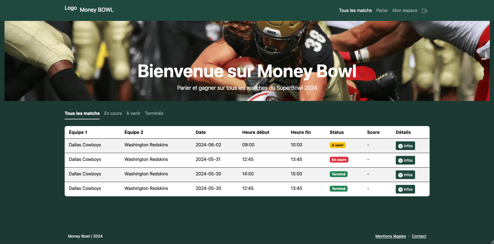

# ECF-SuperBowl

Consulter sur : <http://sc4foal9574.universe.wf/superbowl/>

A student project to provide a full digital service to manage matchs and bets during the SuperBowl Event.

## Gestion de Projet

Vue globale du projet sur Notion : <https://www.notion.so/a4acd42edfff45ddbc9752474d2581f7?v=886eb23535b84f7f885e0923766d4f70>

## Les fonctionnalités principales

### Version Application Web

* Voir les matches, miser, parier
* Détails d'un match
* Inscription/Connexion et mot de passe oublié
* Espace Utilisateur avec historique des mises
* Espace Admin avec gestion des équipes et des matches

### Version Mobile

A terminer...

### Version Desktop

A terminer...

## Déploiement sur serveur Apache (PHP 8.2)

A terminer...
